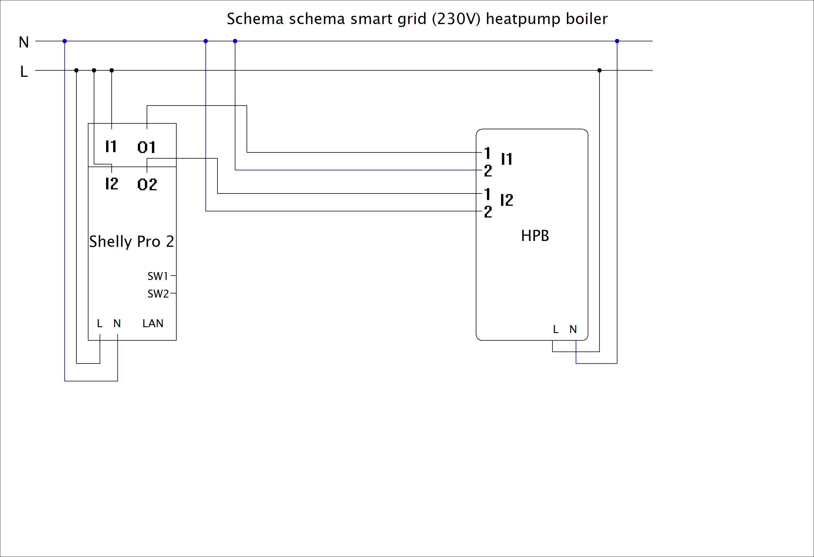

---
authors:
    - Bernd Verhofstadt
weight: 50
---
# Smart Grid Ready heat pump boiler

## At a glance

- Explains what Smart Grid Ready means and how the two input contacts (I1 / I2) map to different operating modes.
- Shows how the Atlantic Explorer v5 heat pump boiler is wired to a Shelly Pro 2 for 230 V smart‑grid control.
- Includes an OpenHab JSRule example that selects the appropriate mode based on grid injection and time of day.

In this setup I combine three building blocks to make my domestic hot water production a bit smarter:

- OpenHab as central home automation and logic engine
- A Shelly Pro 2 (two dry-contact relays) for switching the smart grid inputs
- An Atlantic Explorer v5 heat pump boiler with Smart Grid Ready contacts (I1 / I2)

The goal is simple: when there is cheap or self-produced electricity available, I want the boiler to heat more aggressively; when electricity is expensive or scarce, I want it to reduce or pause heating – without touching the normal safety controls of the heat pump.

Below I explain how the Smart Grid Ready concept works in general, how the Atlantic Explorer v5 interprets the signals on I1 / I2, and how I tie everything together with the Shelly Pro 2 and OpenHab.



!!! warning "230 V smart‑grid inputs"
	This page focuses on the **230 V Smart Grid Ready contacts variant** as used on my Atlantic Explorer v5. Many other heat pumps use **potential‑free (dry) contacts**; the principles are very similar, but the electrical wiring is different. Always check the documentation of your own device.

## What I have in this setup

At a high level the solution consists of:

- **Heat pump boiler**: Atlantic Explorer v5 with two Smart Grid Ready inputs, labelled **I1** and **I2** (two pairs of terminals).  
	The boiler firmware interprets different on/off combinations of these inputs as different operating modes.
- **Smart grid relay**: **Shelly Pro 2** mounted on DIN rail in the electrical cabinet.  
	It has **two independent dry-contact relays**, perfect for controlling the two smart grid inputs.
- **Automation platform**: **OpenHab**, running rules and scripts that decide, every minute, which smart grid mode should be active (based for example on PV production, electricity tariffs, time-of-use pricing, manual overrides, …).

The Shelly Pro 2 sits electrically between the mains and the Atlantic’s smart grid inputs. OpenHab only talks IP to the Shelly; it never touches any high‑voltage wiring.

## What “Smart Grid Ready” means

"Smart Grid Ready" (often abbreviated **SG Ready**) is a label used for heat pumps and similar devices that can react to signals from the electrical grid or a local controller:

- The device exposes dedicated input terminals (smart grid contacts).
- These inputs encode a **2‑bit signal**: typically two independent contacts that can each be open or closed.
- The heat pump maps the 4 possible combinations to four operating modes.

This allows an energy manager (utility, PV controller, home automation) to do things like:

- Stop the heat pump completely during scarcity or grid problems.
- Run at normal comfort settings most of the time.
- Slightly increase operation when there is surplus energy.
- Run in a full **boost** mode when there is a lot of cheap or self‑produced energy available.

For a general overview and wiring ideas, the unofficial Shelly guide has an excellent article:  
<https://shelly.guide/application-guide/heat-pump-control/>

## Smart grid contact states (Atlantic Explorer v5)

The Atlantic Explorer v5 exposes two smart grid inputs **I1** and **I2**. Each input can be **inactive** or **active**, and the combination of both selects the operating mode of the boiler.

!!! warning "Confirm mapping in the manual"
	Always confirm in the official Atlantic Explorer v5 manual which contact state corresponds to which mode for your exact model and firmware. The table below reflects the typical SG Ready mapping (2‑bit code) and is meant as an implementation example.

Typical mapping for a SG Ready heat pump with two contacts:

| I1 state | I2 state | Mode (conceptual)                  | Typical use case                               |
|----------|----------|------------------------------------|------------------------------------------------|
| Open     | Open     | Normal operation                   | Default day‑to‑day mode                        |
| Closed   | Open     | Stop / lock‑out                    | Grid problems, very high tariff                |
| Open     | Closed   | PV / eco mode (elevated setpoint) | Moderate surplus PV or cheaper electricity     |
| Closed   | Closed   | Boost mode (max operation)         | Strong PV over‑production or very cheap energy |

On the Atlantic, you configure in the boiler menu which functions are bound to I1/I2 (naming can differ slightly per manual revision). Once that is done, the Shelly Pro 2 simply switches the contacts on and off according to the logic defined in OpenHab.

## 230 V smart grid vs. potential‑free contacts

Smart grid interfaces on heat pumps come in two main flavors:

### Potential‑free (dry) contacts

Many SG Ready implementations expect **potential‑free contacts**:

- The heat pump provides a low‑voltage reference (often 12–24 V).  
- The external controller only has to **close or open** the circuit with a relay contact.  
- No external voltage is supplied into the heat pump’s SG terminals.

In this case, any relay with **isolated, dry contacts** (like the Shelly Pro 2) can be wired directly to the SG terminals without bringing its own mains voltage to those contacts.

### 230 V smart grid contacts

The Atlantic Explorer v5 variant used here expects **230 V on the smart grid inputs**:

- The SG terminals I1 / I2 are designed to **sense presence or absence of mains voltage**.  
- When the controlling relay connects 230 V to I1 or I2, the boiler sees that input as active.  
- When the relay opens, the input is inactive.

This has a few important consequences:

- Wiring must respect all local electrical regulations: you are switching mains voltage.  
- The relays must be rated for 230 V AC switching. The Shelly Pro 2 is suitable for this when wired correctly.  
- You must keep a clear separation between low‑voltage control (Ethernet / IP / automation) and the high‑voltage side.

!!! note "230 V variant only"
	The wiring and examples on this page are written for a **230 V smart grid input** as on my Atlantic Explorer v5. If your heat pump expects potential‑free contacts only, **do not** apply 230 V to the SG inputs. Instead, use the Shelly’s dry contacts to bridge the low‑voltage terminals provided by the manufacturer.

## Wiring overview (Shelly Pro 2 ↔ Atlantic Explorer v5)

The high‑level wiring for this setup is:

1. Supply the Shelly Pro 2 with 230 V mains according to the Shelly documentation.  
2. Use the Shelly’s **relay outputs** to switch 230 V to the Atlantic’s **I1** and **I2** inputs (per the Atlantic wiring diagram for the 230 V SG variant).  
3. Connect OpenHab to the Shelly over the network (TCP/IP). No direct connection is needed between OpenHab and the boiler.

The full schematic of my wiring is included above as an image:  
`docs/assets/schema-smart-grid-heatpump-proficad.png` in this repository.

## Automation logic in OpenHab

On the software side, OpenHab decides when to activate which SG mode. Typical inputs for the rule are:

- Current and forecasted **PV production**
- Current household **consumption** and grid import/export
- **Electricity tariff** (day/night, dynamic prices, …)
- **Hot water demand** or tank temperature
- Manual overrides (e.g. "boost for 2 hours")

The rule then sets the two Shelly Pro 2 relays to the desired I1/I2 combination. In my setup the rule runs **every minute** and updates the SG state if needed.

### OpenHab rule example

Below is the OpenHab JSRule that runs every minute to control the Shelly Pro 2 based on my grid injection power and time of day. It translates those conditions into the four SG Ready states by driving the two Shelly outputs (HPB_SG_1 and HPB_SG_2):

```js
rules.JSRule({
    name: "Smart SG Contact for HPB",
//  triggers: [triggers.ItemStateChangeTrigger("energyhome_Vermogen")],
    triggers: [triggers.GenericCronTrigger("0 * * * * ?")], // every minute
    execute: (data) => {
        const { QuantityType } = require('@runtime');

        const raw = items.getItem("energyhome_Vermogen").state; // e.g., "508 W"
        const q = new QuantityType(raw);
        const injection = q.toUnit("W").floatValue(); // Negative = producing to grid, Positive = consuming from grid

        const now = new Date();
        const hour = now.getHours();
        const currentMode = items.getItem("HPB_Mode").state;

        // Power consumption per mode (approximate)
        // Boost:   1650W - 1800W -> heats to 62°C
        // Comfort: 450W - 600W  -> heats to 62°C
        // Normal:  450W - 600W  -> heats to 54°C

        // Thresholds for ENTERING a mode (based on effective solar production)
        const BOOST_ENTER_THRESHOLD = -1800;    // Need 1800W+ excess to enter Boost
        const COMFORT_ENTER_THRESHOLD = -600;   // Need 600W+ excess to enter Comfort

        // Threshold for EXITING a mode - only when actually taking from grid
        const EXIT_TO_LOWER_THRESHOLD = 100;     // Only downgrade when consuming >100W from grid

        function setMode(mode) {
            const sg1 = items.getItem("HPB_SG_1");
            const sg2 = items.getItem("HPB_SG_2");
            const hpbMode = items.getItem("HPB_Mode");

            switch (mode) {
                case "Normal":
                    if (sg1.state !== "OFF") sg1.sendCommand("OFF");
                    if (sg2.state !== "OFF") sg2.sendCommand("OFF");
                    break;
                case "Boost":
                    if (sg1.state !== "ON") sg1.sendCommand("ON");
                    if (sg2.state !== "ON") sg2.sendCommand("ON");
                    break;
                case "Comfort":
                    if (sg1.state !== "ON") sg1.sendCommand("ON");
                    if (sg2.state !== "OFF") sg2.sendCommand("OFF");
                    break;
                case "Off":
                    if (sg1.state !== "OFF") sg1.sendCommand("OFF");
                    if (sg2.state !== "ON") sg2.sendCommand("ON");
                    break;
            }

            if (hpbMode.state !== mode) {
                hpbMode.postUpdate(mode);
                console.log(`[HPB] Mode changed: ${currentMode} -> ${mode}, injection=${injection} W`);
            }
        }

        // Calculate effective solar production by adding back current HPB consumption
        // This tells us how much solar we'd have if the heat pump wasn't running
        function getEffectiveSolarProduction() {
            let currentConsumption = 0;
            switch (currentMode) {
                case "Boost":
                    currentConsumption = 1725; // avg of 1650-1800W
                    break;
                case "Comfort":
                case "Normal":
                    currentConsumption = 525;  // avg of 450-600W
                    break;
                case "Off":
                default:
                    currentConsumption = 0;
                    break;
            }
            // injection is negative when producing to grid
            // effective production = injection - consumption (more negative = more production)
            // Example: injection=-400W (in Boost), consumption=1725W
            //          effective = -400 - 1725 = -2125W (we're actually producing 2125W)
            return injection - currentConsumption;
        }

        console.log(`[HPB] Triggered at ${now.toISOString()}, injection=${injection} W, hour=${hour}, currentMode=${currentMode}`);

        // Night Logic (before 7 AM or after 8 PM)
        if (hour < 7 || hour > 20) {
            if (injection > 10000) {
                setMode("Off");
            } else {
                setMode("Normal");
            }
            return;
        }

        // Safety fallback for invalid readings
        if (isNaN(injection)) {
            setMode("Normal");
            return;
        }

        // Smart daytime logic with hysteresis
        const effectiveProduction = getEffectiveSolarProduction();
        console.log(`[HPB] Effective solar production: ${effectiveProduction} W (corrected for ${currentMode} consumption)`);

        let targetMode = currentMode;

        if (currentMode === "Boost") {
            // === BOOST MODE ===
            // Stay in Boost unless we're actually consuming from the grid (>10W)
            if (injection > EXIT_TO_LOWER_THRESHOLD) {
                // We're taking power from the grid, need to step down
                console.log(`[HPB] Exiting Boost - consuming ${injection}W from grid`);
                
                // Determine which mode to drop to based on effective production
                if (effectiveProduction < COMFORT_ENTER_THRESHOLD) {
                    targetMode = "Comfort"; // Still enough for Comfort
                } else {
                    targetMode = "Normal";  // Fall back to Normal
                }
            }
            // Otherwise stay in Boost (injection is still negative or <=10W)
            
        } else if (currentMode === "Comfort") {
            // === COMFORT MODE ===
            if (injection > EXIT_TO_LOWER_THRESHOLD) {
                // Consuming from grid, drop to Normal
                console.log(`[HPB] Exiting Comfort - consuming ${injection}W from grid`);
                targetMode = "Normal";
            } else if (effectiveProduction < BOOST_ENTER_THRESHOLD) {
                // Enough excess power to upgrade to Boost
                console.log(`[HPB] Upgrading to Boost - effective production: ${effectiveProduction}W`);
                targetMode = "Boost";
            }
            // Otherwise stay in Comfort
            
        } else if (currentMode === "Off") {
            // === OFF MODE ===
            // Only stay in Off if consuming >10000W from grid, otherwise go to Normal
            if (injection > 10000) {
                targetMode = "Off";
            } else {
                // Consumption dropped, check if we can upgrade or fall back to Normal
                if (effectiveProduction < BOOST_ENTER_THRESHOLD) {
                    console.log(`[HPB] Exiting Off -> Boost - effective production: ${effectiveProduction}W`);
                    targetMode = "Boost";
                } else if (effectiveProduction < COMFORT_ENTER_THRESHOLD) {
                    console.log(`[HPB] Exiting Off -> Comfort - effective production: ${effectiveProduction}W`);
                    targetMode = "Comfort";
                } else {
                    console.log(`[HPB] Exiting Off -> Normal - consumption dropped below 10000W`);
                    targetMode = "Normal";
                }
            }
            
        } else {
            // === NORMAL MODE (or unknown) ===
            // Check if we can upgrade based on effective production
            if (effectiveProduction < BOOST_ENTER_THRESHOLD) {
                console.log(`[HPB] Entering Boost - effective production: ${effectiveProduction}W`);
                targetMode = "Boost";
            } else if (effectiveProduction < COMFORT_ENTER_THRESHOLD) {
                console.log(`[HPB] Entering Comfort - effective production: ${effectiveProduction}W`);
                targetMode = "Comfort";
            } else if (injection > 10000) {
                // Only enter Off when consuming >10000W from grid
                targetMode = "Off";
            } else {
                // No solar or low consumption - stay in Normal
                targetMode = "Normal";
            }
        }

        setMode(targetMode);
    }
});
```

## References and thanks

- Official Atlantic Explorer v5 documentation (smart grid / I1–I2 inputs) – see the product manual provided by Atlantic.
- Shelly Pro 2 application guide for SG Ready heat pumps:  
	<https://shelly.guide/application-guide/heat-pump-control/>

