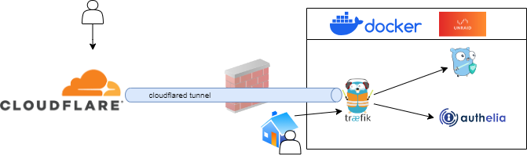

---
authors:
    - Bernd Verhofstadt
weight: 40
---
# It all starts with communication



You can find many useful videos on docker networks, reverse proxy and cloudflared tunnel. This guide will show you what you need for a basic setup.

You need a common network before you set up different containers for a [reverse proxy (Traefik)](Reverse-Proxy.md), [DNS server (Blocky)](DNS-server.md), [Cloudflared Tunnel](Tunnel.md) and [authentication service (Authelia)](../Authentication/index.md). This allows these services to talk to each other.


## The concept explained
Why do we need or want a tunnel? In the past, I created NAT rules and opened incoming ports on my router. This is a big risk, and certainly on a private setup where most (or all) equipment is not ready to monitor and act for threads. The Cloudflare tunnel does not require any ports to be opened. The tunnel towards Cloudflare is created from within the private network. Note that all encrypted traffic will be decrypted at Cloudflare and again encrypted with other SSL certs. If you do not want that this is happening, you may want to use other (paid) services or create your own on a cloud instance. Usually, I use these containers when I'm home. With a local DNS server, I can make sure traffic is going directly to the container and not via the tunnel, when the client uses a public DNS service, the container is reachable via Cloudflare's service.


## Create custom docker network
On the Unraid dashboard, open the CLI and enter the following line of code. To make this work, make sure Docker is enabled under the settings. I called the custom network `docknet`.

```
docker network create docknet
```

After running this line, the custom network will be selectable when installing a new container via Unraid.